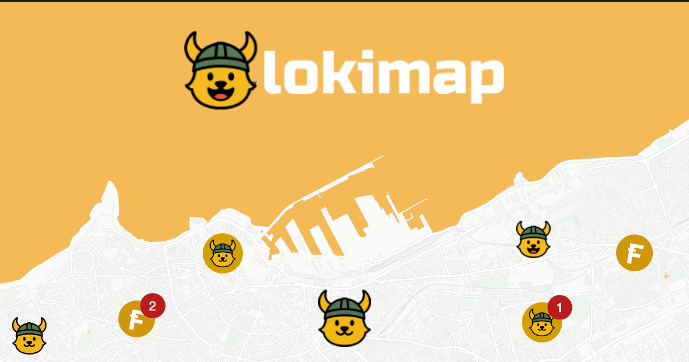

<p align="center">
  
</p>

# Lokichain Peers Map

Explore the Lokichain network in real time.  
View where nodes are located across the world and gain insights into their clients and versions.

## Features

- Interactive global map that clusters peers and highlights regional activity
- Peer detail cards showing geographic location, client type, and version information
- Live stats panel summarizing peers by client family and release
- Displays the current stable release of Flokicoin Core for reference

## Requirements

- Node.js 18 or newer
- Yarn or npm

## Configuration

The app expects an accessible peers API exposing a `/peers` endpoint. Create `.env.local` in the project root and point it to your endpoint:

```bash
NEXT_PUBLIC_PEERS_API_URL=http://localhost:8787
```

- The frontend calls `GET {BASE_URL}/peers`.
- Responses must return an array of peers with IDs, IPs, `subVer`, and optional geolocation metadata.

### Sample response

```json
{
  "peers": [
    {
      "id": "string",
      "ip": "1.2.3.4",
      "subVer": "Flokicoind:0.1.0",
      "geo": {
        "status": "success",
        "lat": 48.8566,
        "lon": 2.3522,
        "city": "Paris",
        "country": "FR"
      }
    }
  ]
}
```

## Getting Started

Install dependencies and launch the development server:

```bash
yarn && yarn dev
# or
npm install && npm run dev
```

## Production Build

```bash
yarn build && yarn start
# or
npm run build && npm start
```

## License

MIT (see `package.json`).
